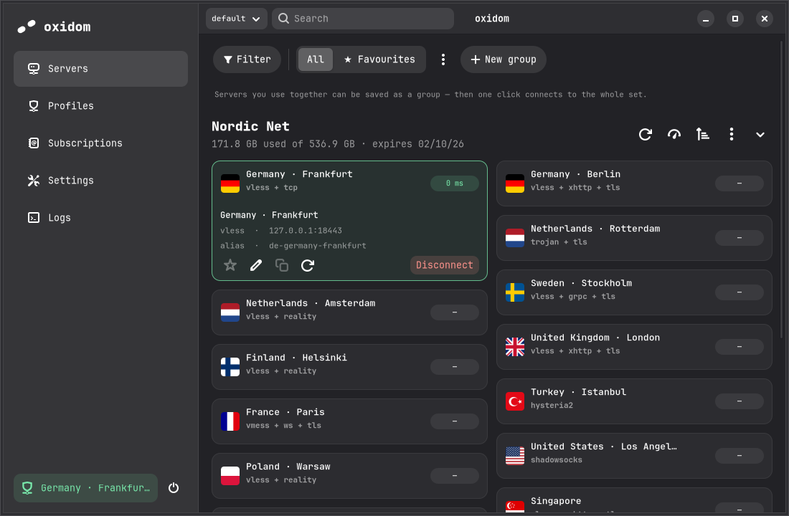

# oxidom

*oxided freedom* — a native Linux desktop **Xray / v2ray client** built with
GTK4 + libadwaita in Rust. Inspired by [Happ] and the GNOME Files (Nautilus)
aesthetic.

oxidom manages subscriptions and standalone servers, drives an **Xray core**
child process (generating its JSON config), and exposes the tunnel as local
SOCKS5 + HTTP proxies — with an optional GNOME system-proxy toggle, optional TUN
interfaces, and per-app routing. The GUI runs fully unprivileged.

<picture>
  <source media="(prefers-color-scheme: dark)" srcset="docs/screenshots/servers-connected-dark.png">
  <source media="(prefers-color-scheme: light)" srcset="docs/screenshots/servers-connected-light.png">
  
</picture>

## Features

- **Subscriptions**: base64 share-link lists, provider-selected Xray JSON,
  sing-box JSON, and Clash YAML responses (including native Xray balanced
  profiles); quota/expiry from `subscription-userinfo` headers.
- **Protocols**: VLESS (Reality / XTLS-Vision / xhttp / ws / grpc / tcp),
  VMess, Trojan, Shadowsocks (SIP002), SOCKS, HTTP, Hysteria2 (obfuscation and
  port hopping; needs Xray 26.1+, which is where the native outbound landed).
- **Server browser**: multi-column card grid with country flags, inline card
  details, search, per-subscription latency check and sort.
- **Pools**: select many servers by rule or by list and let the core balance
  across them, so activity spreads over exit addresses and a dead node does not
  end the session.
- **Several tunnels at once**: profiles run side by side, each on its own
  loopback address, optionally each on its own TUN interface.
- **Per-app routing**: `oxidom run -- <cmd>` sends one command through a profile
  and leaves everything else on the ordinary route.
- **Latency probes**: ICMP / TCP / HTTP HEAD / HTTP GET (through the tunnel),
  selectable in Settings.
- **Privacy**: HWID device headers are strictly opt-in per subscription; no
  telemetry. State files are written `0600`.
- Crash-safe: an orphaned xray child, a stuck GNOME system proxy, or leftover
  routes and devices left by a killed instance are repaired on the next start.

## Install

**NixOS (flake):**

```nix
inputs.oxidom.url = "github:keepinfov/oxidom";
# ...
imports = [ inputs.oxidom.nixosModules.default ];
programs.oxidom.enable = true;          # GUI
programs.oxidom.trayAutostart = true;   # tray at login
services.oxidom.enable = true;          # system daemon at boot
services.oxidom.tun.enable = true;      # allow TUN interfaces
```

**Arch (AUR):** `packaging/aur/PKGBUILD` (`oxidom-git`), then
`systemctl enable --now oxidom.service`.

**Anything else:** a Rust toolchain (1.85+), GTK4 and libadwaita development
packages, and an `xray` binary.

Full instructions, the tested distro matrix, and the from-source asset list are in
**[docs/installation.md](docs/installation.md)**.

## Try it

```sh
nix run github:keepinfov/oxidom      # the GUI
```

or, in a clone:

```sh
nix develop -c cargo run -p oxidom-gui       # graphical client
nix develop -c cargo run -p oxidom -- daemon # headless daemon
nix build                                    # both wrapped binaries
```

```sh
oxidom connect ch-trojan
oxidom status
oxidom ip --egress
```

## Documentation

| | |
|---|---|
| [Installation](docs/installation.md) | NixOS, Arch, from source, tested distro matrix |
| [Quickstart](docs/quickstart.md) | Subscription → connected → verified |
| [GUI guide](docs/gui.md) | The five pages, filters and groups, the tray |
| [CLI reference](docs/cli.md) | Every command, flag, exit code, JSON schema |
| [Configuration](docs/configuration.md) | `config.toml`, paths, environment variables |
| [Profiles and pools](docs/profiles-and-pools.md) | Profile files, balancing, systemd units |
| [Subscriptions and protocols](docs/subscriptions-and-protocols.md) | Link schemes, formats, HWID and privacy |
| [Routing](docs/routing.md) | Local proxies, system proxy, TUN, per-app routing |
| [Architecture](docs/architecture.md) | Crates, the daemon, the security model |
| [Troubleshooting](docs/troubleshooting.md) | By symptom, with the real error text |

## Architecture in one paragraph

The Cargo workspace is split into three crates: `oxidom-core` contains the shared
tunnel, subscription, probe, and D-Bus client logic; `oxidom` is the headless
CLI/daemon; and `oxidom-gui` is the GTK application. `oxidom daemon` owns the
tunnel and serves D-Bus (`dev.keepinfov.oxidom.Daemon`); the GUI is a thin client
with a tray icon. Closing the window keeps the connection; the daemon can run as a
system service that starts at boot and survives logout. Launching the GUI without
a daemon auto-spawns a session one. See
[docs/architecture.md](docs/architecture.md), and
[`AGENTS.md`](AGENTS.md) for the full implementation spec.

## Status

The local-proxy workflow (SOCKS/HTTP inbounds + GNOME system proxy), TUN
interfaces, pools and per-app routing are implemented. Routing-rule editing is
still planned.

## License

[MIT](LICENSE)

[Happ]: https://happ.su/
